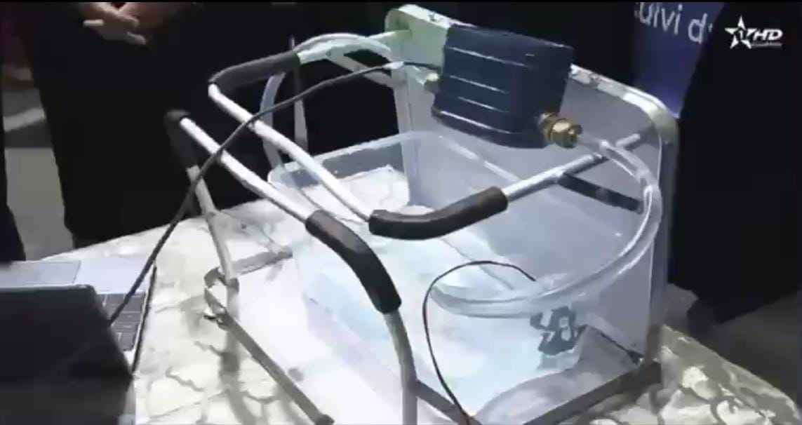
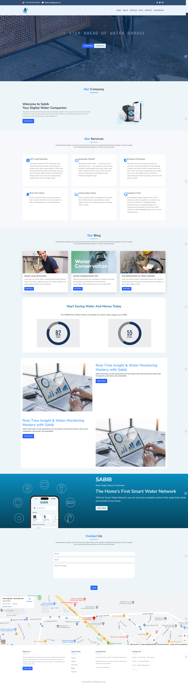

# SABIB: Smart Water Flow Monitoring and Leak Detection System
## Save Today, Secure Tomorrow

## Abstract

### Background and Problem Statement  
Water scarcity is a pressing issue in the Souss Massa region of Morocco, impacting agriculture, daily life, and community sustainability. Current water usage practices are inefficient due to the lack of real-time monitoring, leading to resource wastage and heightened strain on limited water supplies.

### Impact and Proposed Solution  
SABIB aims to address this challenge with an innovative solution: a smart water flow monitoring and leak detection system. By providing real-time insights into water consumption and detecting leaks, SABIB empowers individuals and businesses to implement sustainable water management practices, conserving resources and reducing costs.

### Project Outcomes and Deliverables  
- **Smart Water Flow Measurement Device**: A hardware device capable of monitoring water flow and consumption.  
- **Leak Detection Model**: AI-powered leak detection to identify anomalies in water usage patterns.  
- **Dashboard**: A user-friendly interface displaying real-time water usage data and alerts.  
- **Documentation**: Detailed project documentation, including setup instructions and technical details.  

---

## Instructions

### Prerequisites  
- Hardware: ESP32, flow sensor, electrovalve, LEDs, and necessary connectors.  
- Software: Arduino IDE, Python 3.x, and required libraries (listed in `requirements.txt`).  
- Accounts: ThingSpeak API for data visualization.

### Hardware Setup  
1. Connect the flow sensor to the ESP32's GPIO pin.  
2. Wire the electrovalve to the designated pin.  
3. Connect the LEDs to GPIO pins for status indicators.  
4. Power the ESP32 and verify connections.  

### Software Setup  
1. Clone the repository:  
```bash
   git clone https://github.com/your-repo/sabib.git
```
2. Install Python dependencies:
```bash
    pip install -r requirements.txt
```
3. Flash the ESP32 with the provided esp32_code.ino.

4. Run the leak detection model:
```bash
python leak_detection_model.py
```


### Pitch Vedio : [here](https://drive.google.com/file/d/11e1IZ-wIoxZ3nnoahPDl8tspk21IvXmd/view?usp=drive_link)

### Presentation Slides: [here](https://www.canva.com/design/DAGX92HWk6c/DPwoumVbXRVd3yMPsINIjA/edit?utm_content=DAGX92HWk6c&utm_campaign=designshare&utm_medium=link2&utm_source=sharebutton)

### AI Model: [here](https://colab.research.google.com/drive/1jgHgSA4g-mV0_C_Nvm_oYHGf4ks6og2C?usp=sharing)

### Prototype



### Screenshot



### LICENSE
[LICENSE](LICENSE)